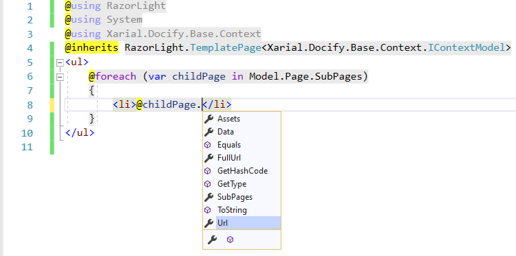

Pseudo-dynamic content (resolved during the compilation time) can be used when writing [layouts](/layouts/) and [includes](/includes/). In this case, the files use the Razor Pages syntax and usually named as *.cshtml files, although this is not a requirement.

Razor Pages are resolved using the [Razor Light](https://github.com/toddams/RazorLight) engine.

Such a page can access the data model to read the information about current site, page, metadata etc.

The following snippet will generate the url node and create page's url with title.

~~~ html
<a href="@Model.Page.Data["title"]">@Model.Page.FullUrl</a>
~~~

Data model is defined in the *Base.Context.dll*

~~~
Model
    Site - Access to the current site
        Configuration - configuration (dictionary) of the current site
        BaseUrl - base url of the site
        MainPage - root page of the site
    Page - current page
        Url - relative url of the current page
        FullUrl - full url of the current page (including base url)
        Data - Metadata of the current page (dictionary)
        SubPages - Direct children of this page
        Assets - Direct assets of this page
    Data - current metadata of the include
~~~

In order to enable IntelliSense, add the reference to *Base.Context.dll* and [Razor Light](https://www.nuget.org/packages/RazorLight) nuget package. Then use @inherits as shown below

~~~ html
@using RazorLight
@using System
@using Xarial.Docify.Base.Context
@inherits TemplatePage<Xarial.Docify.Base.Context.IContextModel>
<ul>
    @foreach (var childPage in Model.Page.SubPages)
    {    
        <li>@childPage.Url</li>
    }
</ul>
~~~

The above code will generate an unordered list of urls of all children pages of the current page.