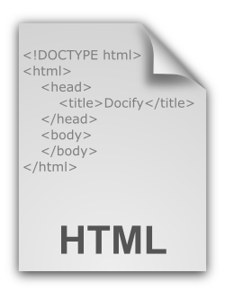

Docify is a static site generator which means that the content of the page will not be changed after the compilation (the exception are Java Scripts which can dynamically change the DOM).

Docify supports 2 types of content: static (markdown of pages) and dynamic (layouts and includes).

## Static Content

The content of the page files will be resolved during the compilation time and converted into the corresponding html files. Docify is using [markdig](https://github.com/lunet-io/markdig) engine to convert markdown into html. Below are the most commonly used syntax examples:

### Plain Text

Plain text will be resolved to corresponding paragraphs in the html

~~~ md
First Line

Second Line
~~~

#### Result

First Line

Second Line

### Headings

Use # symbol to specify the headings 

~~~ md
# Headings1
## Headings2
### Headings3
#### Headings4
~~~

#### Result

# Headings1
## Headings2
### Headings3
#### Headings4

### Url

~~~ md
[Docify Site](https://docify.net)

[Pages Absolute Url](/pages/)

[Relative Url Of Image](sample-image.png)
~~~

#### Result

[Docify Site](https://docify.net)

[Pages Absolute Url](/pages/)

[Relative Url Of Image](sample-image.png)

### Image

Image uses a similar format to url, but with a ! symbol at the beginning. Additional attributes, such as width and height can be added by adding the \{\} after the image as shown below

~~~ md

{ width=100 }
{ height=200 }
{ height=50, width=150 }
~~~

#### Result


{ width=100 }
{ height=200 }
{ height=50 width=150 }

### Text Decorations

~~~ md
*Italic Text*

**Bold Text**
~~~

#### Result

*Italic Text*

**Bold Text**

### HTML Code

html code can be injected into the markdown:

~~~ md
<u>underlined text</u>
~~~

#### Result

<u>underlined text</u>

### Code Snippets

Use ~~~ to fence the code snippet. Optionally specify the language

``` md
~~~ cs
var myVar = "Hello World";
Console.WriteLine(myVar);
~~~
```

#### Result

~~~ cs
var myVar = "Hello World";
Console.WriteLine(myVar);
~~~

### Unordered Lists

~~~ md
* Item 1
  * Item 1-1
  * Item 1-2
* Item 2
  * Item 2-1
* Item 3
~~~

#### Result

* Item 1
  * Item 1-1
  * Item 1-2
* Item 2
  * Item 2-1
* Item 3

### Ordered List

~~~ md
1. Item 1
1. Item 2
1. Item 3
~~~

#### Result

1. Item 1
1. Item 2
1. Item 3

### Tables

~~~ md
|Header1|Header2|
|--|--|
|cell1|cell2|
|cell3|cell4|
|cell5|cell6|
~~~

#### Result

|Header1|Header2|
|--|--|
|cell1|cell2|
|cell3|cell4|
|cell5|cell6|

### Special Symbols

Use \\ symbol for escaping special symbols

~~~ md
\\
\{\}
\[not url](not url)
~~~

#### Result

\\
\{\}
\[not url](not url)

## Dynamic Content

Pseudo-dynamic content (resolved during the compilation time) can be used when writing [layouts](/layouts/) and [includes](/includes/). In this case, the files use the Razor Pages syntax and usually named as *.cshtml files, although this is not a requirement.

Razor Pages are resolved using the [Razor Light](https://github.com/toddams/RazorLight) engine.

Such a page can access the data model to read the information about current site, page, metadata etc.

The following snippet will generate the url node and create page's url with title.

~~~ html
<a href="@Model.Page.Data["title"]">@Model.Page.FullUrl</a>
~~~

Data model is defined in the *Base.Context.dll*

~~~
Model
    Site - Access to the current site
        Configuration - configuration (dictionary) of the current site
        BaseUrl - base url of the site
        MainPage - root page of the site
    Page - current page
        Url - relative url of the current page
        FullUrl - full url of the current page (including base url)
        Data - Metadata of the current page (dictionary)
        SubPages - Direct children of this page
        Assets - Direct assets of this page
    Data - current metadata of the include
~~~

In order to enable IntelliSense, add the reference to *Base.Context.dll* and [Razor Light](https://www.nuget.org/packages/RazorLight) nuget package. Then use @inherits as shown below


~~~ html
@using RazorLight
@using System
@using Xarial.Docify.Base.Context
@inherits TemplatePage<Xarial.Docify.Base.Context.IContextModel>
<ul>
    @foreach (var childPage in Model.Page.SubPages)
    {    
        <li>@childPage.Url</li>
    }
</ul>
~~~

The above code will generate an unordered list of urls of all children pages of the current page.