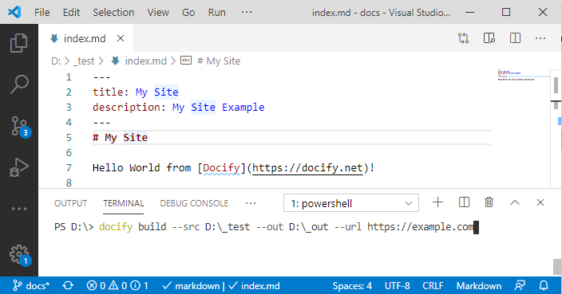
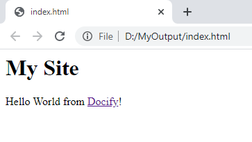

Docify is available as [.NET Core Global Tool](https://docs.microsoft.com/en-us/dotnet/core/tools/global-tools) and published on [Nuget.org](https://www.nuget.org/packages/Docify/).

## Installing And Updating Docify

Docify can be installed by running the following command:

~~~
> dotnet install -g docify
~~~

To update to newer version run

~~~
> dotnet update -g docify
~~~

Once installed, explore the options by calling the *--help* of *docify*

~~~
> docify --help
~~~

## Development Environment

Docify files are plain text file and any compatible text editor can be used. The recommended text editors are [Visual Studio Code](https://code.visualstudio.com/), [Notepad++](https://notepad-plus-plus.org/), [Atom](https://atom.io/), [Visual Studio](https://visualstudio.microsoft.com/)

## Building Static Sites

To build a simple site use the following command

~~~
> docify build --src C:\MySite --out C:\MyOutput --url https://example.com
~~~

All files from the *C:\MySite* folder will be published to the *C:\MyOutput*.

It is possible to specify multiple folders for compilation

~~~
> docify build --src C:\MySiteDir1 C:\MySiteDir2 --out C:\MyOutput --url https://example.com
~~~

This can be useful to separate the content and the frames and layouts.

### Using Libraries

In order to use [custom library](/custom-library/) use *--l* switch and specify the path to library directory

~~~
> docify build --src C:\MySite C:\MySiteDir2 --out C:\MyOutput --url https://example.com --l D:\MyLibrary
~~~

To use secure library, specify the path to manifest and public key XML separated by |

~~~
> docify build --src C:\MySite C:\MySiteDir2 --out C:\MyOutput --url https://example.com --l D:\MySecureLibrary.manifest|D:\SecureLibraryPublicKey.xml
~~~

To use standard library specify * as library path

~~~
> docify build --src C:\MySite C:\MySiteDir2 --out C:\MyOutput --url https://example.com --l *
~~~

## Example

* Create folder at D:\MySite
* Add new text file *index.md*
* Place the following content into the file

~~~ md
# My Site

Hello World from [Docify](https://docify.net)!
~~~

* If not already installed, run the following command to install docify (note, do not copy > symbol, it is used to indicate the command line):

~~~
> dotnet install -g docify
~~~

* Run the following command to build the site

~~~
> docify build --src D:\MySite --out D:\MyOutput --url https://example.com
~~~

* As the result index.html file is generated in the *D:\MyOutput* which converted static markdown into the html page as follows:

~~~ html
<h1 id="my-site">My Site</h1>

Hello World from <a href="https://docify.net">Docify</a>!

~~~

Follow this user guide to learn more features of docify which allows to create websites for your blog or technical documentation. This help documentation itself is generated by Docify. You can explore the source code for documentation [here](https://github.com/xarial/docify/tree/master/docs)

