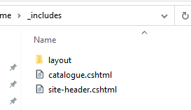

Includes are files with the [c# razor page](https://docs.microsoft.com/en-us/aspnet/core/razor-pages/?view=aspnetcore-3.1&tabs=visual-studio) syntax allowing to generate pseudo-dynamic content which is resolved at the compile time.

Includes can be used in the [pages](/pages/), [layouts](/layouts/). Includes can be also resolved in [assets](/assets/) if corresponding filter is set in the [configuration](/configuration/).

Includes are single files (usually in .cshtml) format placed in the special **_includes** folder.

The file name is considered as include name.

In order to refer the include in the content, it is required to specify include name between the **\\**

~~~
#Page Title

\
~~~

Include can be placed into the subfolder(s), in this case sub-folders must be separated by **::** when referring include.

~~~
#Page Title

\
~~~

## Metadata

Includes can contain [metadata](/metadata/) which can be accessed via *Model.Data* property.

~~~ cs
---
attribute: value
---
@using RazorLight
@using System
@inherits TemplatePage<Xarial.Docify.Base.Context.IContextModel>
@{
    var attVal = Model.Data.GetOrDefault<string>("attribute");
}

@attVal

~~~

Include metadata has 4 layers of inheritance listed below (in the order of override)

### Default values specified in the include's front matter

This is the lowest level of inheritance (default value) and will only be used if none of the below layers override the value. If the attribute is present in the include's front matter it is guaranteed to be available in the data model, so it is possible to use **Model.Data.Get** instead of **Model.Data.GetOrDefault**

### Include metadata specified in the configuration file

Include settings can be set globally in the [configuration](/configuration/) file. In this case, it is required to use a special token for include **$** followed by include name. For example for include *my-include* with attribute *my-property*, the global value can be configured as follows:

~~~
$my-include:
  my-property: Some Value
~~~

In the above case *my-property* for all *my-include* used in the site will have a value of *Some Value* unless overridden on the layers below.

### Include metadata specified in the page's front-matter

Same as specifying the global settings in the configuration file it is possible to specify the setting on a page level-only, so all includes within this page would have the specified value

~~~
---
layout: default
title: My Page
$my-include:
  my-property: Some Value
---
# My Page
~~~

## Include metadata specified when referencing include in the content

Metadata can be also assigned to include while referencing it in the content. In this case, its metadata should be passed as an inline yaml.

~~~
---
layout: default
title: My Page
---
# My Page

\

\
~~~