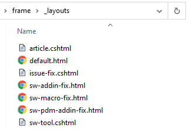

Layouts allow to define the reusable portion of the html page.

Layouts support [dynamic content](/content/dynamic/) and can include pseudo-dynamic portions of code.

Layouts must include *{{ content }}* placeholder which will be replaced by corresponding content of the page or inherited layouts.

Layout files must be placed into the *_layouts* special folder in the root of the site.

Name of the file is the name of the layout.

> Markdown content in the layout will not be resolved. Only use html and cshtml in the layouts

## Referring Layouts

Layouts can be specified by adding the *layout* attribute into the page or layout [metadata](/metadata/). As this option can be placed into the layout itself, inheritance is supported.

~~~ yml
---
layout: default
---
~~~

Layouts are optional, but in most cases pages would have layout assigned. 

Most of the pages in the site will use the same layout. Instead of defining the *layout* attribute in each page, it is possible to define the global default layout by specifying its name in the [configuration](/configuration/) file:

~~~ yml
default-layout: default
~~~

In this case, all pages (not layouts) by default inherit the specified layout unless explicitly overridden if *layout* attribute is not specified.

In order to automatically inherit the layout for the children pages, use the $ as the layout name

In this case, all children pages will use the parent's page layout.

For example, the following pages structure will result in all pages, except Page3 to have layout **L1**, while Page3 will be assigned with layout **L2**

* Page1 (layout L1)
    * Page2 (layout $)
    * Page3 (layout L2)
    * Page4 (layout $)
        Page5 (layout $)

## Layout Example

The below example is a typical layout for the master page, containing the base html.

~~~ html
<!DOCTYPE html>
<html>
<head>
<title>Page</title>
</head>
<body>
{{ content }}
</body>
</html>
~~~

However, the above example will not resolve the page title and all generated html files will have the same title **Page**.

In order to resolve this issue, dynamic layout can be used:

~~~ html
@using RazorLight
@using System
@using Xarial.Docify.Base.Context
@using Xarial.Docify.Lib.Tools
@inherits TemplatePage<Xarial.Docify.Base.Context.IContextModel>
@{
    var pageTitle = Model.Page.Data.GetOrDefault<string>("title");
}
<!DOCTYPE html>
<html>
<head>
    <title>@pageTitle</title>
</head>
<body>
    {{ content }}
</body>
</html>
~~~

In this case, the title will be extracted for each corresponding page [metadata](/metadata/):

~~~ yml
---
layout: default
title: Page1
---
~~~

~~~ yml
---
layout: default
title: Page2
---
~~~