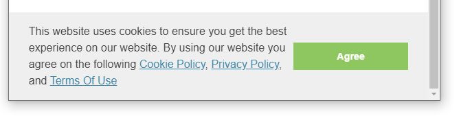

This component allows to manage the cookie consent acceptance form in accordance with [GDPR Compliant Use of Cookies‎](https://gdpr.eu/cookies/).

If your web-site collects and tracks any user activity, such as [Google Analytics](/standard-library/components/google-analytics/) you might need to show the consent to comply with regulations and laws.

This component is using [Osano JavaScript API](https://www.osano.com/cookieconsent/documentation/javascript-api/)

## Parameters

* enable - true to enable, false to disable
* message - html supported message to display in the popup

## Usage

Add the include into the head

~~~ html
<head>
    \
</head>
~~~

This component is included into the [base theme](/standard-library/themes/base/)