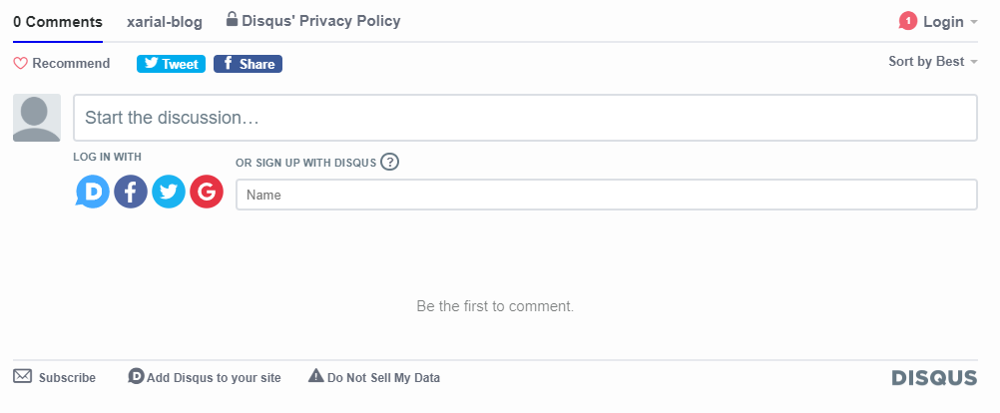
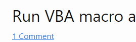

{ width=600 }

This component allows to enable comments for the pages on the site.

Component is using [Disqus](https://disqus.com/) for comments. It is required to have Disqus account to use this component (free version is supported).

## Parameters

* short-name - disqus account short name
* count - true to enable the comments count badge
* environment - [environment](/getting-started#using-environment) where comments are enabled (default *production*). Use *-* to enable comments in all environments.
* sitemap (page metadata) - if false, comments will not be rendered
* comments (page metadata) - if false, comments will not be rendered

## Usage

Add the include into the html, where it needs to be rendered.

~~~ html
<article class="post">
    \
</article>
~~~

To show the comments count badge add the 

~~~ html

~~~

This component is included into the [user guide theme](/standard-library/themes/user-guide/) and [blog theme](/standard-library/themes/blog/)