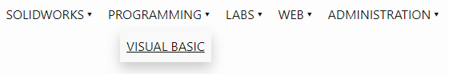
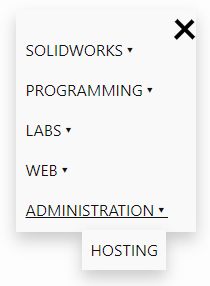

This component allows adding the menu into the site either automatically generated or custom defined. The menu can have any levels of sub-menu items.

Menu is responsive and will change in the mobile version of the site (based on the width of the page)

## Parameters

* home-menu - indicate if the home menu item needs to be created
* menu - [predefined menu](#predefined-menu) (if this option is not specified than automatic menu will be created based on the top-level pages)
* root-page - starting page for this menu where to load the children pages 
* upper-case - true to set all the names of the menu items to upper case
* filter - filter array for pages to include into the menu
* title-attribute - name of the attribute which holds the title for this page (default value is title)

All pages which have *sitemap* parameter set to *false* will be ignored

## Usage

Refer *_assets/scripts/nav.js* and *_assets/scripts/nav.css* into the site.

Refer the include

~~~ html jagged
<head>
    
    <link rel="stylesheet" type="text/css" href="/_assets/styles/nav.css" />
</head>

    \

~~~

### Predefined Menu

In some cases, it is required to predefine the menu instead of automatically loading the root pages. Use *menu* parameter to defined multi-level menu

~~~
$nav:
  menu:
    - MenuItem1:
      - /page1/
      - /page2/
      - SubMenuItem1:
        - /page4/
    - MenuItem2:
      - /page3/
    - '[Custom Name 1](/){ |/page5/* }'
    - '[Custom Name 2](/page5/)'
~~~

When url is specified, the title of the corresponding page will be used as title, page link will be clickable and will redirect to the specified url once clicked.

When name is specified, this item is considered as a parent menu item and will not be clickable, but will display all children items as submenu items.

In order to specify the custom name to the menu (instead of loading this from the page), use the markdown url syntax (*Custom Name 2* menu from the example above).

Submenu items will automatically highlight parent items based on the activated url. However, in some cases, this might cause an issue if both parent and child sub pages are added as the root menu. In this case, it is possible to specify comma-separated filter of scope pages (*Custom Name 1* in the example above). As an example, if this filter is not specified, activating *Custom Name 2* will also highlight *Custom Name 1* as */* url is a parent of */page5/* url.