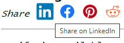

This component allows to add the social share badge to enable a shortcut for sharing the page on social platforms.

## Parameters

* linkedin - true (default) to enable sharing on LinkedIn
* facebook - true (default) to enable sharing on Facebook
* pinterest - true (default) to enable sharing on Pinterest
* reddit - true (default) to enable sharing on Reddit
* color - custom color. If not specified, default color of the social platform is used

## Usage

Add the reference to */_assets/styles/social-share.css* style into the head of the page.

Add the include into the HTML node (usually added to the header of the article)

~~~ html jagged
<head>
    <link rel="stylesheet" type="text/css" href="/_assets/styles/social-share.css" />
</head>
<header>
    \
</header>
~~~

This component is included into the [blog theme](/standard-library/themes/blog/) and [user guide theme](/standard-library/themes/user-guide/)