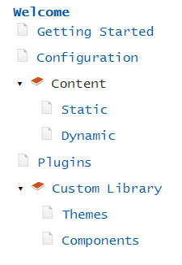

This component allows adding the Table Of Content (TOC) into the site either automatically generated or custom defined. Table Of Content can have any levels of sub-menu items.

## Parameters

* title-attribute - name of the attribute which holds the title for this page (default value is caption)
* home-menu - indicate if the home (welcome) menu item needs to be created
* menu - [predefined menu](#predefined-table-of-content) (if this option is not specified than automatic menu will be created based on all pages)
* home-menu-title - Name of the home menu if *home-menu* option is set to *true* (default is Welcome)
* root-page - starting page for this Table Of Content where to load the children pages 
* filter - filter array for pages to include into the Table Of Content
* title-case - true to set all the names of the items to *Title Case* (default false)
* toc (page metadata) - *false* to exclude this page from the Table Of Content, *true* to include (even if *sitemap* option is set to *false*)

All pages which have *sitemap* parameter set to *false* will be ignored

## Usage

Refer *_assets/scripts/toc.js* and *_assets/scripts/toc.css* into the site.

Refer the include

~~~ html jagged
<head>
    
    <link rel="stylesheet" type="text/css" href="/_assets/styles/toc.css" />
</head>

    \

~~~

### Predefined Table Of Content

In some cases, it is required to predefine the Table Of Content instead of automatically loading the pages. Use *menu* parameter to defined multi-level menu

~~~
$toc:
  menu:
    - MenuItem1:
      - /page1/
      - /page2/
      - SubMenuItem1:
        - /page4/
    - MenuItem2:
      - /page3/
    - '[Custom Name 1](/)'
    - '[Custom Name 2](/page5/)'
~~~

When url is specified, the title of the corresponding page will be used as title, page link will be clickable and will redirect to the specified url once clicked.

When name is specified, this item is considered as a parent menu item and will not be clickable, but will display all children items as submenu items.

In order to specify the custom name to the menu (instead of loading this from the page), use the markdown url syntax (*Custom Name 2* menu from the example above).

This component is included into the [user guide theme](/standard-library/themes/user-guide/) and [blog theme](/standard-library/themes/blog/)
