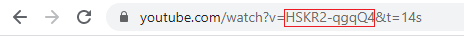

This components provides a shortcut of embedding video from YouTube from the site.

Embedded video frame is responsive and will change when the page resizes.

## Usage

Add the reference to *_assets/styles/youtube.css* style into the HTML head

~~~ html jagged
<head>
    <link rel="stylesheet" type="text/css" href="/_assets/styles/youtube.css" />
</head>
~~~

Refer include and specify the video id.

~~~
\
~~~

Video ID can be found in the YouTube url

This component is included into the [user guide theme](/standard-library/themes/user-guide/) and [blog theme](/standard-library/themes/blog/)