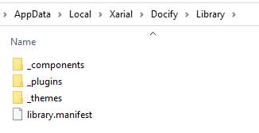

Standard library of Docify is hosted on web and can be installed via *library --install* command

~~~
> docify library --install
~~~

The above command will also update to the latest version of the library.

To check if there is any updates available use the 

~~~
> docify library --check-updates
~~~

Standard library contains components, themes, and plugins. Explore this section for the list of available items.

Standard library of Docify is deployed as [secure library](/custom-library#secure-library/) and installed to *%localappdata%\Xarial\Docify\Library* directory. As this is a secure library, modifying of the content directly in this location is prohibited and would result in the error on file signature validation stage.

Installation or update will fail if any of the files were modified. In this case, the error will be displayed to console. To resolve the conflict, remove the library manually from the installation directory.

In order to modify the standard component, copy it to your [custom library](/custom-library/) and optionally give it a different name so it doesn't conflict with the standard library.