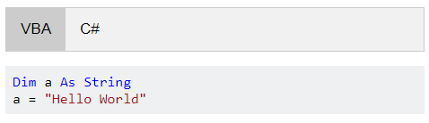
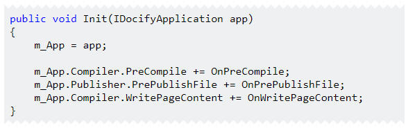

This plugin enables referring code snippets from external files. This simplifies the management of code as it is not embedded into the markdown file rather stays independent. This allows to employ code validation practices such as unit testing without compromising a markdown.

This plugin embeds the code as markdown snippet

```
~~~ lang
code
~~~
```

Use [Code Syntax Highlighter](/standard-library/plugins/code-syntax-highlighter/) to enable code syntax highlighting.

## Parameters

### Plugin

* snippets-folder - predefined external folder for snippets to load. See [snippets folder usage](#snippets-folder)
* auto-tabs - list of auto tabs to generate when placeholder snippet is used. See [tabs usage](#tabs)
* exclude-snippets - instructs the engine to avoid publishing of the snippet file to the destination site (default is true)

### Include

* file-name - name of the file to include. Supports subfolder, relative and absolute paths
* tabs - dictionary of tab names and respective files, see [tabs usage](#tabs) for an example
* regions - list of regions to include from the code snippet. See [regions usage](#tabs) for an example
* excl-regions - list of regions to exclude from the code snippet. See [regions usage](#tabs) for an example 
* left-align - true to align the code to the left
* lang - code language

## Usage

~~~
\
~~~

### Tabs

This plugin enables the grouping of the code by tabs. This is usually used when the same code snippet is provided in different languages. In order to split code by tabs, use the *tabs* parameter, specify the name of the tab as the key and the value as the file:

~~~
\
~~~



In most cases the language tabs will be consistent across pages. Instead of specifying the tabs in each include, it is possible to specify the global auto tabs which will be automatically filled based on available files.

Set the auto tabs map in the [configuration](/configuration/) file as follows:

~~~
^code-snippet:
  auto-tabs: 
    cs: C#
    vba: VBA
    vb: VB.NET
    cpp: C++
~~~

Now use the * wildcard for the file extension.

~~~
\
~~~

In this case, if *tab* subfolder of the page would contain 2 files *code2.cs* and *code2.vb* this will automatically create 2 tabs for C# and VB.NET. If this folder also contains code2.cpp C++ tab will be added as well.

### Regions

Regions allow selecting the code snippet(s) to display from a complete file. For example, having the following complete file

~~~ cs
public class DocifyPlugin : IPlugin
{
    private IDocifyApplication m_App;

//--- init
    public void Init(IDocifyApplication app)
    {
        m_App = app;
        
        m_App.Compiler.PreCompile += OnPreCompile;
        m_App.Publisher.PrePublishFile += OnPrePublishFile;
        m_App.Compiler.WritePageContent += OnWritePageContent;
    }
//---

    private Task OnPreCompile(ISite site) => Task.CompletedTask;
    private Task OnPrePublishFile(ILocation outLoc, PrePublishFileArgs args) => Task.CompletedTask;
    private Task OnWritePageContent(StringBuilder html, IMetadata data, string url) => Task.CompletedTask;
}
~~~

To only include *Init* function, fence the code with *//--- NAME* and *//---* and specify the region by name

~~~
\
~~~



Multiple regions can be specified. The default comment symbol is used as the start of the fence (i.e. // for C#, Java etc., and ' for VB.NET, VBA).

In a similar way regions to exclude can be specified with *excl-regions* parameter. In this case, the regions will be excluded from the code.

Nested regions are supported. Both exclude and include regions at the same time are supported.

The snippet will be automatically rendered with the jagged line depending on what code has been excluded based on the regions. This plugin embeds the *jagged* style so it is possible to enable this feature for the custom snippets as well as follows:

```
~~~ cs jagged
Console.WriteLine("Hello World!");
~~~
```

```
~~~ cs jagged-bottom
Console.WriteLine("Hello World!");
~~~
```

```
~~~ cs jagged-top
Console.WriteLine("Hello World!");
~~~
```

### Snippets Folder

When writing user guides it might be beneficial to keep the source code in the separate (root-level folder). Source code might be a part of a complete project with supporting files and unit tests. In this case rather than copy each individual snippet to the destination page folder or referring it from the root folder, it is possible to assign the snippets folder as a plugin setting and use *~* to refer the file from this folder.

~~~
^code-snippet:
  snippets-folder: snippets
~~~

*snippets* folder contains project file and snippet can be referenced from any page as follows:

~~~
\
~~~