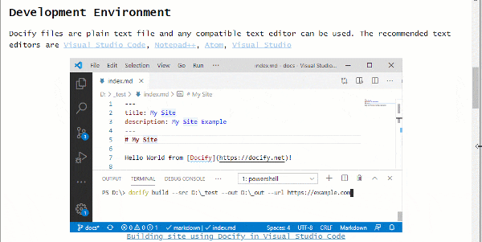

This plugin will automatically generate a responsive layout for all images and will add the figure text.

Image can have initial size assigned to it but will resize automatically to fit the screen.

## Usage

Plugin will automatically enable the responsiveness for all images inserted in markdown and image alt text will be added to figure caption.

~~~

~~~