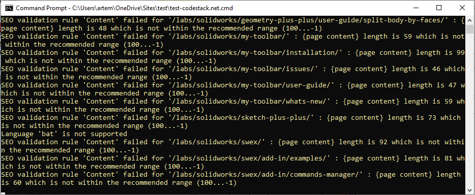

This plugin automatically runs Search Engine Optimization (SEO) rules during the build process to ensure the page employs good SEO practices.

## Settings

* scope - array of paths filters to run rules for
* treat-error-as-warning - true to raise an error and stop the build process if any of the rules fails. false (default) to output the warning into the console and continue the build process
* validators - list of validators and parameters
    * title - validates title of the page
        * min-length - Minimum symbols in the title (default 50), -1 for any value
        * max-length - Maximum symbols in the title (default 60), -1 for any value
    * description - validates the description of the page
        * min-length - Minimum symbols in the description (default 50), -1 for any value
        * max-length - Maximum symbols in the description (default 150), -1 for any value
    * content - validates the content of the page
        * content-node-selector - XPath to select a node containing the content to validate (default //body)
        * min-words - Minimum number of words in the content (default 500), -1 for any value
        * max-words - Maximum number of words in the content (default -1), -1 for any value

## Usage

Set the rules in the [configuration](/configuration/) file.

~~~
^seo-validator:
  scope:
    - /section1/*
    - /section2/*
  validators:
    title:
      min-length: 30
      max-length: 90
    description:
      min-length: 40
      max-length: 250
    content:
      content-node-selector: //article
      min-words: 100
      max-words: -1
~~~

Depending on the *treat-error-as-warning* option if plugin finds any page which doesn't satisfy the rule it either stops the process displaying an error or outputs the warning into the console.

