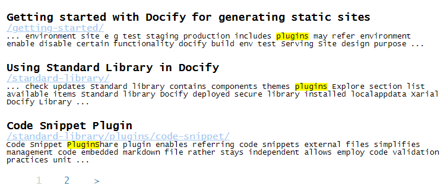

This plugin is based on [Tipue Search](https://tipue.com/search/) and enables the search capabilities for the static site.

Search will generate an index file containing the information about keywords and corresponding pages. This file will be loaded and parsed to provide search results based on the query.

## Parameters

* page-content-node - XPath HTML node to index content from (default *//body*)
* search-page-layout - name of the layout to display search results in (default empty)
* search-page-title - title of the search results page (default *Search Results*)

## Usage

Insert the include where the search box should be displayed

~~~ html

\

~~~

> Note the search result page set in the *search-page-layout* setting must also contain this include, otherwise results will not be displayed
