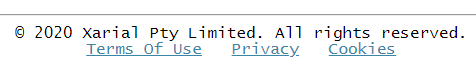
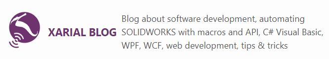

This is a parent theme for [user guide theme](/standard-library/themes/user-guide/) and [blog theme](/standard-library/themes/blog/).

This theme contains basic templates setup and enables the most common plugins and components.

## Layouts

* master - contains the basic frame for the HTML5 page. This layout includes all the assets from the components used by the base theme. In also enables individual pages to inject custom (page specific) scripts and styles by using the corresponding attributes in the [metadata](/metadata/)

~~~
scripts:
  - /page1/script1.js
  - /page1/script2.js
styles:
  - /page1/style1.css
  - /page1/style2.css
~~~

* void - empty layout, inherited from master layout

## Standard Library Components

### Components

* [seo](/standard-library/components/seo/)
* [sitemap](/standard-library/components/sitemap/)
* [google-analytics](/standard-library/components/google-analytics/)
* [feed](/standard-library/components/feed/)
* [social-share](/standard-library/components/social-share/)
* [youtube](/standard-library/components/youtube/)
* [cookie-consent](/standard-library/components/cookie-consent/)
* [social-links](/standard-library/components/social-links/)

### Plugins:

* [image-optimizer](/standard-library/plugins/image-optimizer/)
* [responsive-image](/standard-library/plugins/responsive-image/)
* [tipue-search](/standard-library/plugins/tipue-search/)
* [redirect](/standard-library/plugins/redirect/)
* [embed](/standard-library/plugins/embed/)

## Theme Specific Components

### Date 



This [include](/includes/) allows to add a current date with the specified format

~~~
\
~~~

### Legal



Generates a footer with the references to legal information (i.e. Terms Of Use, Privacy Policy, Cookies Policy etc.) and copyright notices

Specify the company name (site url is default) and list of names and corresponding links to legal urls

~~~
$legal:
  company: Xarial Pty Limited
  links:
    Terms Of Use: /terms-of-use/
    Privacy: /privacy-policy/
    Cookies: /cookies-policy/
~~~

~~~ html

    \

~~~

### Page Language



Component resolves the language of the page and add this to a HTML page header

~~~ html jagged-bottom
<!DOCTYPE html>
<html lang="">
<head>
~~~

Language is extracted from the *lang* attribute of the page [metadata](/metadata/) or [configuration](/configuration/) for the global option.

Default value is *en* and can be assigned via *default-lang* attribute of the include.

### Site Header



Component provides a generic responsive layout for the site header. It includes title of the site, description and icon.

~~~ html jagged

\

~~~

Width of the icon can be specified via *icon-width* attribute (default is 75px). *show-title* indicates if the title needs to be displayed (default true).

The title and description of the site are extracted from the corresponding attributes of the main page.