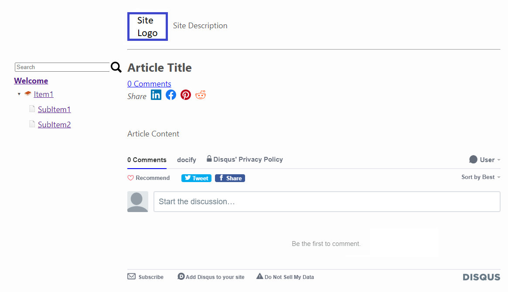
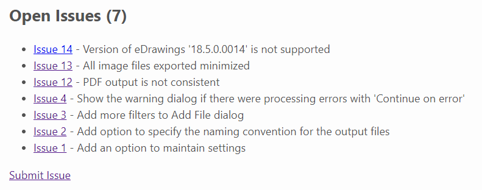



This theme is designed for the creation of user guides and technical documentation. Theme is based on [base theme](/standard-library/themes/base/).

{ width=600 }

## Layouts

* article - layout for the article page.

## Standard Library Components

### Components

* [disqus](/standard-library/components/disqus/)
* [toc](/standard-library/components/toc/)

### Plugins:

* [code-syntax-highlighter](/standard-library/plugins/code-syntax-highlighter/)
* [code-snippet](/standard-library/plugins/code-snippet/)

## Theme Specific Components

### GitHub Issues

Loads the list of GitHub issues for the public repository with an option to raise new issue.

~~~ html

\

~~~

